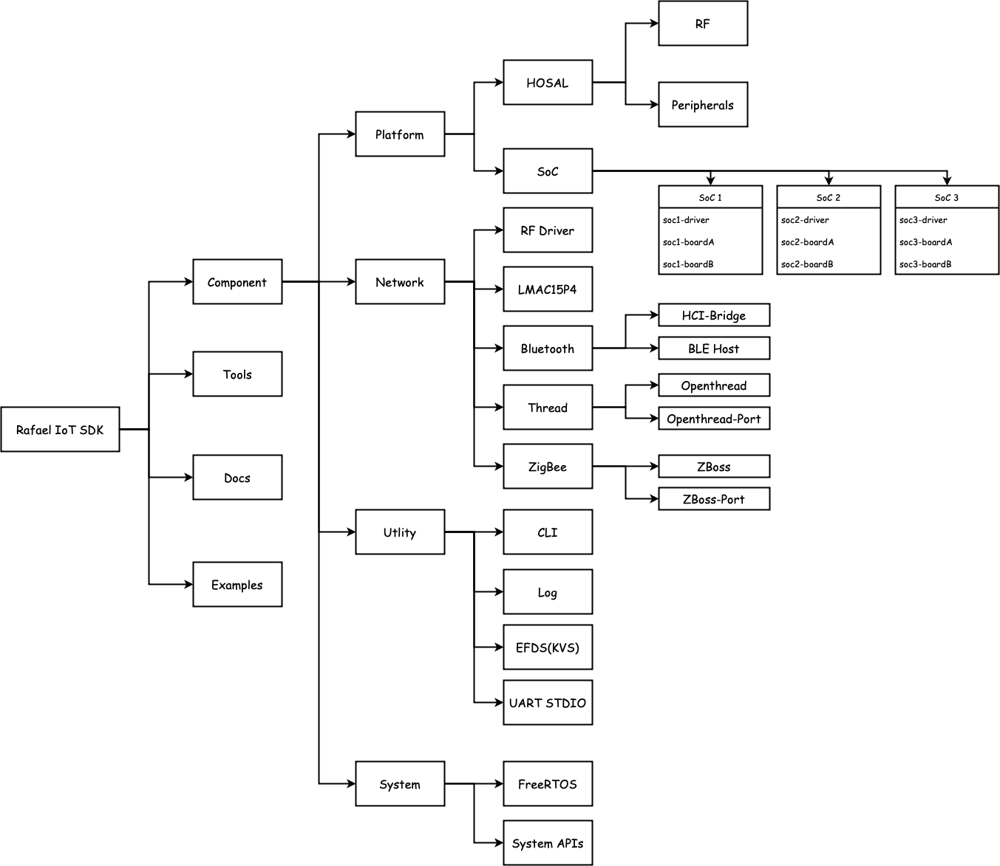

# Rafael IoT SDK Coding Style

# SDK 結構



# Coding Rule

## Component / Examples 資料夾規則

1. 英文縮寫或單字串接請使用 dash 而不是底線
2. 請新增“src”及“include”資料夾
3. src 內放置 source code 及此 component 私有的 header file, include 資料夾內放置會提供給其他人使用的 header file
4. Open source code 例外

## Source code 檔案名稱命名規則

1. 檔名一率使用英文小寫
2. Open source code 例外

## C Coding Rule

### 定義

1. 強度：以下特定關鍵字按照 RFC2119 中的描述解釋

   - **MUST** : **必須**
   - **MUST NOT** : **不允許**
   - **SHOULD** : **應該**
   - **SHOULD NOT** : **不應該**
   - **MAY** : **可以**

2. 命名風格：皆為必須

   - 蛇型(Snake case) : `snake_case`, `the_name`
   - 大寫蛇型(Screaming snake case) : `SCREAMING_SNAKE_CASE`, `THE_NAME`

3. 命名偏好：皆為應該
   - 具描述性：代表用更多文字精確敘述
   - 簡潔有力：代表盡可能簡短。

### General rules

1. 縮排**必須**使用 `4` 個空白（`Space`），**不允許**用 `Tab` 字元
2. 任何名稱都...

   i. **不允許**加上單/雙底線（`_` 或 `__`）的前/後綴。

   ii. **不允許**使用阿拉伯數字作為開頭。

   iii. **可以**使用常見的縮寫，常見代表這個縮寫(在此專業領域內)同時滿足：不會造成歧異、一目瞭然、足夠通用。但是需要注意**不允許**打破命名風格規則。

3. 16 進制的數值部分的英文**必須**為大寫，如：`0x3A`, `0xFFBD`。
4. 描述陣列的名稱**應該**使用複數形、集合名詞或容器等可以表示多個的名詞。
5. 在需要區分的場合，指標**可以**加上`_p`後綴。
6. **應該**盡可能使用 `const` 常數取代巨集常數 `#define`。
7. **應該**盡可能使用 `inline` 取代巨集 `#define`。
8. 檔案末行**必須**有一個換行符號。

### Examples

```c
/* OK */
if (condition)
while (condition)
for (init; condition; step)
do {} while (condition)

/* Wrong */
if(condition)
while(condition)
for(init;condition;step)
do {} while(condition)
```

- Do not use space between function name and opening bracket

```c
int32_t a = sum(4, 3);              /* OK */
int32_t a = sum (4, 3);             /* Wrong */
```

- Never use `__` or `_` prefix for variables/functions/macros/types. This is reserved for C language itself
  - Prefer `prv_` name prefix for strictly module-private (static) functions
  - Prefer `libname_int_` or `libnamei_` prefix for library internal functions, that should not be used by the user application while they MUST be used across different library internal modules
- Use only lowercase characters for variables/functions/types with optional underscore `_` char
- Opening curly bracket is always at the same line as keyword (`for`, `while`, `do`, `switch`, `if`, …)

```c
size_t i;
for (i = 0; i < 5; ++i) {           /* OK */
}
for (i = 0; i < 5; ++i){            /* Wrong */
}
for (i = 0; i < 5; ++i)             /* Wrong */
{
}
```

- Use single space before and after comparison and assignment operators

```c
int32_t a;
a = 3 + 4;              /* OK */
for (a = 0; a < 5; ++a) /* OK */
a=3+4;                  /* Wrong */
a = 3+4;                /* Wrong */
for (a=0;a<5;++a)       /* Wrong */
```

- Use single space after every comma

```c
func_name(5, 4);        /* OK */
func_name(4,3);         /* Wrong */
```

- Do not initialize `global` variables to any default value (or `NULL`), implement it in the dedicated `init` function (if REQUIRED).

```c
static int32_t a;       /* Wrong */
static int32_t b = 4;   /* Wrong */
static int32_t a = 0;   /* Wrong */
```

> In embedded systems, it is very common that RAM memories are scattered across different memory locations in the system.
> It quickly becomes tricky to handle all the cases, especially when user declares custom RAM sections.
> Startup script is in-charge to set default values (.data and .bss) while other custom sections may not be filled with default values, which leads to variables with init value won’t have any effect.
>
> To be independent of such problem, create init function for each module and use it to set
> default values for all of your variables, like so:

```c
static int32_t a;       /* OK */
static int32_t b = 4;   /* Wrong - this value may not be set at zero
                            if linker script&startup files are not properly handled */

void my_module_init(void) {
    a = 0;
    b = 4;
}
```

- Declare all local variables of the same type in the same line

```c
void my_func(void) {
    /* 1 */
    char a;             /* OK */

    /* 2 */
    char a, b;          /* OK */

    /* 3 */
    char a;
    char b;             /* Wrong, variable with char type already exists */
}
```

- Declare local variables in order

  1. Custom structures and enumerations
  2. Integer types, wider unsigned type first
  3. Single/Double floating point

  ```c
  int my_func(void) {
      /* 1 */
      my_struct_t my;     /* First custom structures */
      my_struct_ptr_t* p; /* Pointers too */

      /* 2 */
      uint32_t a;
      int32_t b;
      uint16_t c;
      int16_t g;
      char h;
      /* ... */

      /* 3 */
      double d;
      float f;
  }
  ```

- Always declare local variables at the beginning of the block, before first executable statement
- Always add trailing comma in the last element of structure (or its children) initialization (this helps clang-format to properly format structures). Unless structure is very simple and short

```c
typedef struct {
    int a, b;
} str_t;

str_t s = {
    .a = 1,
    .b = 2,   /* Comma here */
}

/* Examples of "complex" structure, with or with missing several trailing commas, after clang-format runs the formatting */
static const my_struct_t my_var_1 = {
    .type = TYPE1,
    .type_data =
        {
            .type1 =
                {
                    .par1 = 0,
                    .par2 = 1, /* Trailing comma here */
                }, /* Trailing comma here */
        },  /* Trailing comma here */
};

static const my_struct_t my_var_2 = {.type = TYPE2,
                                     .type_data = {
                                         .type2 =
                                             {
                                                 .par1 = 0,
                                                 .par2 = 1,
                                             },
                                     }};    /* Missing comma here */
static const my_struct_t my_var_3 = {.type = TYPE3,
                                     .type_data = {.type3 = {
                                                       .par1 = 0,
                                                       .par2 = 1,
                                                   }}}; /* Missing 2 commas here */

/* No trailing commas - good only for small and simple structures */
static const my_struct_t my_var_4 = {.type = TYPE4, .type_data = {.type4 = {.par1 = 0, .par2 = 1}}};
```

- Declare counter variables in `for` loop

```c
/* OK */
for (size_t i = 0; i < 10; ++i)

/* OK, if you need counter variable later */
size_t i;
for (i = 0; i < 10; ++i) {
    if (...) {
        break;
    }
}
if (i == 10) {

}

/* Wrong */
size_t i;
for (i = 0; i < 10; ++i) ...
```

- Avoid variable assignment with function call in declaration, except for single variables

```c
void a(void) {
    /* Avoid function calls when declaring variable */
    int32_t a, b = sum(1, 2);

    /* Use this */
    int32_t a, b;
    b = sum(1, 2);

    /* This is ok */
    uint8_t a = 3, b = 4;
}
```

- Except `char`, `float` or `double`, always use types declared in `stdint.h` library, eg. `uint8_t` for `unsigned 8-bit`, etc.
- Do not use `stdbool.h` library. Use `1` or `0` for `true` or `false` respectively

```c
/* OK */
uint8_t status;
status = 0;

/* Wrong */
#include <stdbool.h>
bool status = true;
```

- Never compare against `true`, eg. `if (check_func() == 1)`, use `if (check_func()) { ... }`
- Always compare pointers against `NULL` value

```c
void* ptr;

/* ... */

/* OK, compare against NULL */
if (ptr == NULL || ptr != NULL) {

}

/* Wrong */
if (ptr || !ptr) {

}
```

- Always use _pre-increment (and decrement respectively)_ instead of _post-increment (and decrement respectively)_

```c
int32_t a = 0;
...

a++;            /* Wrong */
++a;            /* OK */

for (size_t j = 0; j < 10; ++j) {}  /* OK */
```

- Always use `size_t` for length or size variables
- Always use `const` for pointer if function should not modify memory pointed to by `pointer`
- Always use `const` for function parameter or variable, if it should not be modified

```c

/* When d could be modified, data pointed to by d could not be modified */
void my_func(const void* d) {

}

/* When d and data pointed to by d both could not be modified */
void my_func(const void* const d) {

}

/* Not REQUIRED, it is advised */
void my_func(const size_t len) {

}

/* When d should not be modified inside function, only data pointed to by d could be modified */
void my_func(void* const d) {

}
```

- When function may accept pointer of any type, always use `void *`, do not use `uint8_t *`

  - Function MUST take care of proper casting in implementation

  ```c
  /*

  ```

```c
/*
 * To send data, function should not modify memory pointed to by `data` variable
 * thus `const` keyword is important
 *
 * To send generic data (or to write them to file)
 * any type may be passed for data,
 * thus use `void *`
 */
/* OK example */
void send_data(const void* data, size_t len) { /* OK */
    /* Do not cast `void *` or `const void *` */
    const uint8_t* d = data;/* Function handles proper type for internal usage */
}

void send_data(const void* data, int len) {    /* Wrong, not not use int */
}
```

- Always use brackets with `sizeof` operator
- Never use *Variable Length Array* (VLA). Use dynamic memory allocation instead with standard C `malloc` and `free` functions or if library/project provides custom memory allocation, use its implementation
  - Take a look at [LwMEM](https://github.com/MaJerle/lwmem), custom memory management library

```c
/* OK */
#include <stdlib.h>
void my_func(size_t size) {
    int32_t* arr;
    arr = malloc(sizeof(*arr) * n); /* OK, Allocate memory */
    arr = malloc(sizeof *arr * n);  /* Wrong, brackets for sizeof operator are missing */
    if (arr == NULL) {
        /* FAIL, no memory */
    }

    free(arr);  /* Free memory after usage */
}

/* Wrong */
void my_func(size_t size) {
    int32_t arr[size];  /* Wrong, do not use VLA */
}
```

- Always compare variable against zero, except if it is treated as `boolean` type
- Never compare `boolean-treated` variables against zero or one. Use NOT (`!`) instead

```c
size_t length = 5;  /* Counter variable */
uint8_t is_ok = 0;  /* Boolean-treated variable */
if (length)         /* Wrong, length is not treated as boolean */
if (length > 0)     /* OK, length is treated as counter variable containing multi values, not only 0 or 1 */
if (length == 0)    /* OK, length is treated as counter variable containing multi values, not only 0 or 1 */

if (is_ok)          /* OK, variable is treated as boolean */
if (!is_ok)         /* OK, -||- */
if (is_ok == 1)     /* Wrong, never compare boolean variable against 1! */
if (is_ok == 0)     /* Wrong, use ! for negative check */
```

- Always use `/* comment */` for comments, even for _single-line_ comment
- Always include check for `C++` with `extern` keyword in header file
- Every function MUST include _doxygen-enabled_ comment, even if function is `static`
- Use English names/text for functions, variables, comments
- Use _lowercase_ characters for variables
- Use _underscore_ if variable contains multiple names, eg. `force_redraw`. Do not use `forceRedraw`
- Never cast function returning `void *`, eg. `uint8_t* ptr = (uint8_t *)func_returning_void_ptr();` as `void *` is safely promoted to any other pointer type
  - Use `uint8_t* ptr = func_returning_void_ptr();` instead
- Always use `<` and `>` for C Standard Library include files, eg. `#include <stdlib.h>`
- Always use `""` for custom libraries, eg. `#include "my_library.h"`
- When casting to pointer type, always align asterisk to type, eg. `uint8_t* t = (uint8_t*)var_width_diff_type`
- Always respect code style already used in project or library

## Comments

- Comments starting with `//` are not allowed. Always use `/* comment */`, even for single-line comment

```c
//This is comment (wrong)
/* This is comment (ok) */
```

- For multi-line comments use `space+asterisk` for every line

```c
/*
 * This is multi-line comments,
 * written in 2 lines (ok)
 */

/**
 * Wrong, use double-asterisk only for doxygen documentation
 */

/*
* Single line comment without space before asterisk (wrong)
*/

/*
 * Single line comment in multi-line configuration (wrong)
 */

/* Single line comment (ok) */
```

- Use `12` indents (`12 * 4` spaces) offset when commenting. If statement is larger than `12` indents, make comment `4-spaces` aligned (examples below) to next available indent

```c
void my_func(void) {
    char a, b;

    a = call_func_returning_char_a(a);          /* This is comment with 12*4 spaces indent from beginning of line */
    b = call_func_returning_char_a_but_func_name_is_very_long(a);   /* This is comment, aligned to 4-spaces indent */
}
```

## Functions

- Every function which may have access from outside its module, MUST include function _prototype_ (or _declaration_)
- Function name MUST be lowercase, optionally separated with underscore `_` character

```c
/* OK */
void my_func(void);
void myfunc(void);

/* Wrong */
void MYFunc(void);
void myFunc();
```

- When function returns pointer, align asterisk to return type

```c
/* OK */
const char* my_func(void);
my_struct_t* my_func(int32_t a, int32_t b);

/* Wrong */
const char *my_func(void);
my_struct_t * my_func(void);
```

- Align all function prototypes (with the same/similar functionality) for better readability

```c
/* OK, function names aligned */
void        set(int32_t a);
my_type_t   get(void);
my_ptr_t*   get_ptr(void);

/* Wrong */
void set(int32_t a);
const char * get(void);
```

## Variables

- Make variable name all lowercase with optional underscore `_` character

```c
/* OK */
int32_t a;
int32_t my_var;
int32_t myvar;

/* Wrong */
int32_t A;
int32_t myVar;
int32_t MYVar;
```

- Group local variables together by `type`

```c
void
foo(void) {
    int32_t a, b;   /* OK */
    char a;
    char b;         /* Wrong, char type already exists */
}
```

- Do not declare variable after first executable statement

```c
void
foo(void) {
    int32_t a;
    a = bar();
    int32_t b;      /* Wrong, there is already executable statement */
}
```

- You may declare new variables inside next indent level

```c
int32_t a, b;a = foo();if (a) {    int32_t c, d;   /* OK, c and d are in if-statement scope */    c = foo();    int32_t e;      /* Wrong, there was already executable statement inside block */}
```

- Declare pointer variables with asterisk aligned to type

```c
/* OK */
char* a;

/* Wrong */
char *a;
char * a;
```

- When declaring multiple pointer variables, you may declare them with asterisk aligned to variable name

```c
/* OK */
char *p, *n;
```

## Structures, enumerations, typedefs

- Structure or enumeration name MUST be lowercase with optional underscore `_` character between words
- Structure or enumeration may contain `typedef` keyword
- All structure members MUST be lowercase
- All enumeration members SHOULD be uppercase
- Structure/enumeration MUST follow doxygen documentation syntax

When structure is declared, it may use one of `3` different options:

- When structure is declared with _name only_, it _MUST not_ contain `_t` suffix after its name.

```c
struct struct_name {
    char* a;
    char b;
};
```

- When structure is declared with _typedef only_, it _has to_ contain `_t` suffix after its name.

```c
typedef struct {
    char* a;
    char b;
} struct_name_t;
```

- When structure is declared with _name and typedef_, it _MUST NOT_ contain `_t` for basic name and it _MUST_ contain `_t` suffix after its name for typedef part.

```c
typedef struct struct_name {    /* No _t */
    char* a;
    char b;
    char c;
} struct_name_t;    /* _t */
```

Examples of bad declarations and their suggested corrections

```c
/* a and b MUST be separated to 2 lines */
/* Name of structure with typedef MUST include _t suffix */
typedef struct {
    int32_t a, b;
} a;

/* Corrected version */
typedef struct {
    int32_t a;
    int32_t b;
} a_t;

/* Wrong name, it MUST not include _t suffix */
struct name_t {
    int32_t a;
    int32_t b;
};

/* Wrong parameters, MUST be all uppercase */
typedef enum {
    MY_ENUM_TESTA,
    my_enum_testb,
} my_enum_t;
```

- When initializing structure on declaration, use `C99` initialization style

```c
/* OK */
a_t a = {
    .a = 4,
    .b = 5,
};

/* Wrong */
a_t a = {1, 2};
```

- When new typedef is introduced for function handles, use `_fn` suffix

```c
/* Function accepts 2 parameters and returns uint8_t */
/* Name of typedef has `_fn` suffix */
typedef uint8_t (*my_func_typedef_fn)(uint8_t p1, const char* p2);
```

## Compound statements

- Every compound statement MUST include opening and closing curly bracket, even if it includes only `1` nested statement
- Every compound statement MUST include single indent; when nesting statements, include `1` indent size for each nest

```c
/* OK */
if (c) {
    do_a();
} else {
    do_b();
}

/* Wrong */
if (c)
    do_a();
else
    do_b();

/* Wrong */
if (c) do_a();
else do_b();
```

- In case of `if` or `if-else-if` statement, `else` MUST be in the same line as closing bracket of first statement

```c
/* OK */
if (a) {

} else if (b) {

} else {

}

/* Wrong */
if (a) {

}
else {

}

/* Wrong */
if (a) {

}
else
{

}
```

- In case of `do-while` statement, `while` part MUST be in the same line as closing bracket of `do` part

```c
/* OK */
do {
    int32_t a;
    a = do_a();
    do_b(a);
} while (check());

/* Wrong */
do
{
/* ... */
} while (check());

/* Wrong */
do {
/* ... */
}
while (check());
```

- Indentation is REQUIRED for every opening bracket

```c
if (a) {
    do_a();
} else {
    do_b();
    if (c) {
        do_c();
    }
}
```

- Compound statement MUST include curly brackets, even in the case of a single statement. Examples below show bad practices

```c
if (a) do_b();
else do_c();

if (a) do_a(); else do_b();
```

- Empty `while`, `do-while` or `for` loops MUST include brackets

```c
/* OK */
while (is_register_bit_set()) {}

/* Wrong */
while (is_register_bit_set());
while (is_register_bit_set()) { }
while (is_register_bit_set()) {
}
```

- If `while` (or `for`, `do-while`, etc) is empty (it can be the case in embedded programming), use empty single-line brackets

```c
/* Wait for bit to be set in embedded hardware unit */
volatile uint32_t* addr = HW_PERIPH_REGISTER_ADDR;

/* Wait bit 13 to be ready */
while (*addr & (1 << 13)) {}        /* OK, empty loop contains no spaces inside curly brackets */
while (*addr & (1 << 13)) { }       /* Wrong */
while (*addr & (1 << 13)) {         /* Wrong */

}
while (*addr & (1 << 13));          /* Wrong, curly brackets are missing. Can lead to compiler warnings or unintentional bugs */
```

- Always prefer using loops in this order: `for`, `do-while`, `while`
- Avoid incrementing variables inside loop block if possible, see examples

```c
/* Not recommended */
int32_t a = 0;
while (a < 10) {
    .
    ..
    ...
    ++a;
}

/* Better */
for (size_t a = 0; a < 10; ++a) {

}

/* Better, if inc may not happen in every cycle */
for (size_t a = 0; a < 10; ) {
    if (...) {
        ++a;
    }
}
```

- Inline `if` statement MAY be used only for assignment or function call operations

```c
/* OK */
int a = condition ? if_yes : if_no; /* Assignment */
func_call(condition ? if_yes : if_no); /* Function call */
switch (condition ? if_yes : if_no) {...}   /* OK */

/* Wrong, this code is not well maintenable */
condition ? call_to_function_a() : call_to_function_b();

/* Rework to have better program flow */
if (condition) {
    call_to_function_a();
} else {
    call_to_function_b();
}
```

### Switch statement

- Add _single indent_ for every `case` statement
- Use additional _single indent_ for `break` statement in each `case` or `default` statement

```c
/* OK, every case has single indent */
/* OK, every break has additional indent */
switch (check()) {
    case 0:
        do_a();
        break;
    case 1:
        do_b();
        break;
    default:
        break;
}

/* Wrong, case indent missing */
switch (check()) {
case 0:
    do_a();
    break;
case 1:
    do_b();
    break;
default:
    break;
}

/* Wrong */
switch (check()) {
    case 0:
        do_a();
    break;      /* Wrong, break MUST have indent as it is under case */
    case 1:
    do_b();     /* Wrong, indent under case is missing */
    break;
    default:
        break;
}
```

- Always include `default` statement

```c
/* OK */
switch (var) {
    case 0:
        do_job();
        break;
    default:
        break;
}

/* Wrong, default is missing */
switch (var) {
    case 0:
        do_job();
        break;
}
```

- If local variables are REQUIRED, use curly brackets and put `break` statement inside.

  - Put opening curly bracket in the same line as `case` statement

  ```c
  switch (a) {
      /* OK */
      case 0: {
          int32_t a, b;
          char c;
          a = 5;
          /* ... */
          break;
      }

      /* Wrong */
      case 1:
      {
          int32_t a;
          break;
      }

      /* Wrong, break shall be inside */
      case 2: {
          int32_t a;
      }
      break;
  }
  ```

## Macros and preprocessor directives

- Always use macros instead of literal constants, especially for numbers
- All macros MUST be fully uppercase, with optional underscore `_` character, except if they are clearly marked as function which may be in the future replaced with regular function syntax

```c
/* OK */
#define SQUARE(x)         ((x) * (x))

/* Wrong */
#define square(x)           ((x) * (x))
```

- Always protect input parameters with parentheses

```c
/* OK */
#define MIN(x, y)           ((x) < (y) ? (x) : (y))

/* Wrong */
#define MIN(x, y)           x < y ? x : y
```

- Always protect final macro evaluation with parenthesis

```c
/* Wrong */
#define MIN(x, y)           (x) < (y) ? (x) : (y)
#define SUM(x, y)           (x) + (y)

/* Imagine result of this equation using wrong SUM implementation */
int32_t x = 5 * SUM(3, 4);  /* Expected result is 5 * 7 = 35 */
int32_t x = 5 * (3) + (4);  /* It is evaluated to this, final result = 19 which is not what we expect */

/* Correct implementation */
#define MIN(x, y)           ((x) < (y) ? (x) : (y))
#define SUM(x, y)           ((x) + (y))
```

- When macro uses multiple statements, protect these using `do {} while (0)` statement

```c
typedef struct {
    int32_t px, py;
} point_t;
point_t p;                  /* Define new point */

/* Wrong implementation */

/* Define macro to set point */
#define SET_POINT(p, x, y)  (p)->px = (x); (p)->py = (y)    /* 2 statements. Last one should not implement semicolon */

SET_POINT(&p, 3, 4);        /* Set point to position 3, 4. This evaluates to... */
(&p)->px = (3); (&p)->py = (4); /* ... to this. In this example this is not a problem. */

/* Consider this ugly code, however it is valid by C standard (not recommended) */
if (a)                      /* If a is true */
    if (b)                  /* If b is true */
        SET_POINT(&p, 3, 4);/* Set point to x = 3, y = 4 */
    else
        SET_POINT(&p, 5, 6);/* Set point to x = 5, y = 6 */

/* Evaluates to code below. Do you see the problem? */
if (a)
    if (b)
        (&p)->px = (3); (&p)->py = (4);
    else
        (&p)->px = (5); (&p)->py = (6);

/* Or if we rewrite it a little */
if (a)
    if (b)
        (&p)->px = (3);
        (&p)->py = (4);
    else
        (&p)->px = (5);
        (&p)->py = (6);

/*
 * Ask yourself a question: To which `if` statement does the `else` keyword belong?
 *
 * Based on first part of code, answer is straight-forward. To inner `if` statement when we check `b` condition
 * Actual answer: Compilation error as `else` belongs nowhere
 */

/* Better and correct implementation of macro */
#define SET_POINT(p, x, y)  do { (p)->px = (x); (p)->py = (y); } while (0)    /* 2 statements. No semicolon after while loop */
/* Or even better */
#define SET_POINT(p, x, y)  do {    \   /* Backslash indicates statement continues in new line */
    (p)->px = (x);                  \
    (p)->py = (y);                  \
} while (0)                             /* 2 statements. No semicolon after while loop */

/* Now original code evaluates to */
if (a)
    if (b)
        do { (&p)->px = (3); (&p)->py = (4); } while (0);
    else
        do { (&p)->px = (5); (&p)->py = (6); } while (0);

/* Every part of `if` or `else` contains only `1` inner statement (do-while), hence this is valid evaluation */

/* To make code perfect, use brackets for every if-ifelse-else statements */
if (a) {                    /* If a is true */
    if (b) {                /* If b is true */
        SET_POINT(&p, 3, 4);/* Set point to x = 3, y = 4 */
    } else {
        SET_POINT(&p, 5, 6);/* Set point to x = 5, y = 6 */
    }
}
```

- Avoid using `#ifdef` or `#ifndef`. Use `defined()` or `!defined()` instead

```c
#ifdef XYZ
/* do something */
#endif /* XYZ */
```

- Always document `if/elif/else/endif` statements

```c
/* OK */
#if defined(XYZ)
/* Do if XYZ defined */
#else /* defined(XYZ) */
/* Do if XYZ not defined */
#endif /* !defined(XYZ) */

/* Wrong */
#if defined(XYZ)
/* Do if XYZ defined */
#else
/* Do if XYZ not defined */
#endif
```

- Do not indent sub statements inside `#if` statement

```c
/* OK */
#if defined(XYZ)
#if defined(ABC)
/* do when ABC defined */
#endif /* defined(ABC) */
#else /* defined(XYZ) */
/* Do when XYZ not defined */
#endif /* !defined(XYZ) */

/* Wrong */
#if defined(XYZ)
    #if defined(ABC)
        /* do when ABC defined */
    #endif /* defined(ABC) */
#else /* defined(XYZ) */
    /* Do when XYZ not defined */
#endif /* !defined(XYZ) */
```

## Documentation

Documented code allows doxygen to parse and generate html/pdf/latex output, thus it is very important to do it properly at an early stage of the project.

- Use doxygen-enabled documentation style for `variables`, `functions` and `structures/enumerations`
- Always use `\` for doxygen, do not use `@`
- Always use `5x4` spaces (`5` tabs) offset from beginning of line for text

```c
/**
 * \brief           Holds pointer to first entry in linked list
 *                  Beginning of this text is 5 tabs (20 spaces) from beginning of line
 */
static
type_t* list;
```

- Every structure/enumeration member MUST include documentation
- Use `12x4 spaces` offset for beginning of comment

```c
/**
 * \brief           This is point struct
 * \note            This structure is used to calculate all point
 *                      related stuff
 */
typedef struct {
    int32_t x;                                  /*!< Point X coordinate */
    int32_t y;                                  /*!< Point Y coordinate */
    int32_t size;                               /*!< Point size.
                                                    Since comment is very big,
                                                    you may go to next line */
} point_t;

/**
 * \brief           Point color enumeration
 */
typedef enum {
    COLOR_RED,                                  /*!< Red color. This comment has 12x4
                                                    spaces offset from beginning of line */
    COLOR_GREEN,                                /*!< Green color */
    COLOR_BLUE,                                 /*!< Blue color */
} point_color_t;
```

- Documentation for functions MUST be written in function implementation (source file usually)
- Function MUST include `brief` and all parameters documentation
- Every parameter MUST be noted if it is `in` or `out` for _input_ and _output_ respectively
- Function MUST include `return` parameter if it returns something. This does not apply for `void` functions
- Function can include other doxygen keywords, such as `note` or `warning`
- Use colon `:` between parameter name and its description

```c
/**
 * \brief           Sum `2` numbers
 * \param[in]       a: First number
 * \param[in]       b: Second number
 * \return          Sum of input values
 */
int32_t sum(int32_t a, int32_t b) {
    return a + b;
}

/**
 * \brief           Sum `2` numbers and write it to pointer
 * \note            This function does not return value, it stores it to pointer instead
 * \param[in]       a: First number
 * \param[in]       b: Second number
 * \param[out]      result: Output variable used to save result
 */
void void_sum(int32_t a, int32_t b, int32_t* result) {
    *result = a + b;
}
```

- If function returns member of enumeration, use `ref` keyword to specify which one

```c
/**
 * \brief           My enumeration
 */
typedef enum {
    MY_ERR,                                     /*!< Error value */
    MY_OK                                       /*!< OK value */
} my_enum_t;

/**
 * \brief           Check some value
 * \return          \ref MY_OK on success, member of \ref my_enum_t otherwise
 */
my_enum_t check_value(void) {
    return MY_OK;
}
```

- Use notation (`NULL` => `NULL`) for constants or numbers

```c
/**
 * \brief           Get data from input array
 * \param[in]       in: Input data
 * \return          Pointer to output data on success, `NULL` otherwise
 */
const void *
get_data(const void* in) {
    return in;
}
```

- Documentation for macros MUST include `hideinitializer` doxygen command

```c
/**
 * \brief           Get minimal value between `x` and `y`
 * \param[in]       x: First value
 * \param[in]       y: Second value
 * \return          Minimal value between `x` and `y`
 * \hideinitializer
 */
#define MIN(x, y)       ((x) < (y) ? (x) : (y))
```

## Header/source files

- Leave single empty line at the end of file
- Every file MUST include doxygen annotation for `file` and `brief` description followed by empty line (when using doxygen)

```c
/**
 * \file            template.h
 * \brief           Template include file
 */
                    /* Here is empty line */
```

- Every file (_header_ or _source_) MUST include license (opening comment includes single asterisk as this MUST be ignored by doxygen)
- Use the same license as already used by project/library

```c
/**
 * \file            template.h
 * \brief           Template include file
 */

/*
 * Copyright (c) year FirstName LASTNAME
 *
 * Permission is hereby granted, free of charge, to any person
 * obtaining a copy of this software and associated documentation
 * files (the "Software"), to deal in the Software without restriction,
 * including without limitation the rights to use, copy, modify, merge,
 * publish, distribute, sublicense, and/or sell copies of the Software,
 * and to permit persons to whom the Software is furnished to do so,
 * subject to the following conditions:
 *
 * The above copyright notice and this permission notice shall be
 * included in all copies or substantial portions of the Software.
 *
 * THE SOFTWARE IS PROVIDED "AS IS", WITHOUT WARRANTY OF ANY KIND,
 * EXPRESS OR IMPLIED, INCLUDING BUT NOT LIMITED TO THE WARRANTIES
 * OF MERCHANTABILITY, FITNESS FOR A PARTICULAR PURPOSE
 * AND NONINFRINGEMENT. IN NO EVENT SHALL THE AUTHORS OR COPYRIGHT
 * HOLDERS BE LIABLE FOR ANY CLAIM, DAMAGES OR OTHER LIABILITY,
 * WHETHER IN AN ACTION OF CONTRACT, TORT OR OTHERWISE, ARISING
 * FROM, OUT OF OR IN CONNECTION WITH THE SOFTWARE OR THE USE OR
 * OTHER DEALINGS IN THE SOFTWARE.
 *
 * This file is part of library_name.
 *
 * Author:          FirstName LASTNAME <optional_email@example.com>
 */
```

- Header file MUST include guard `#ifndef`
- Header file MUST include `C++` check
- Include external header files outside `C++` check
- Include external header files with STL C files first followed by application custom files
- Header file MUST include only every other header file in order to compile correctly, but not more (.c should include the rest if REQUIRED)
- Header file MUST only expose module public variables/types/functions
- Use `extern` for global module variables in header file, define them in source file later

```c
/* file.h ... */
#ifndef ...

extern int32_t my_variable; /* This is global variable declaration in header */

#endif

/* file.c ... */
int32_t my_variable;        /* Actually defined in source */
```

- Never include `.c` files in another `.c` file
- `.c` file should first include corresponding `.h` file, later others, unless otherwise explicitly necessary
- Do not include module private declarations in header file
- Header file example (no license for sake of an example)

```c
/* License comes here */
#ifndef TEMPLATE_HDR_H
#define TEMPLATE_HDR_H

/* Include headers */

#ifdef __cplusplus
extern "C" {
#endif /* __cplusplus */

/* File content here */

#ifdef __cplusplus
}
#endif /* __cplusplus */

#endif /* TEMPLATE_HDR_H */
```
